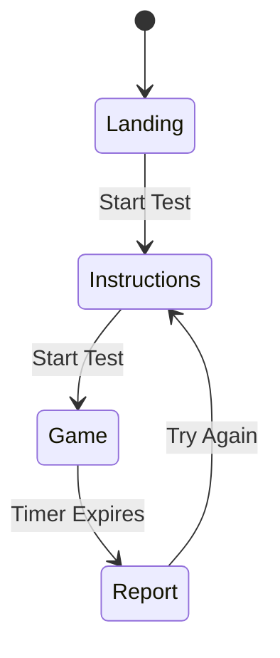

# Design Document: NeuroGym Focus Test MVP

## Overview

The NeuroGym Focus Test MVP is a single-page React web application that delivers a 60-second cognitive assessment game. The application measures focus stability, reaction time, and cognitive switching costs through an interactive symbol classification task with dynamic rule changes.

### Key Design Goals

1. **Zero Backend Dependency**: All logic, calculations, and state management occur client-side
2. **Smooth User Experience**: Seamless transitions between screens with subtle animations
3. **Accurate Performance Measurement**: Precise timing and metrics tracking for cognitive assessment
4. **Responsive Design**: Consistent experience across desktop and mobile devices
5. **Clean Modern Aesthetic**: Minimal UI inspired by Apple Health, Headspace, and Calm

### Technology Stack

- **React 18+**: Component-based UI with hooks for state management
- **Tailwind CSS**: Utility-first styling framework
- **No Backend**: Pure client-side application
- **No External Dependencies**: Minimal third-party libraries (only React and Tailwind)

## Architecture

### Application Structure

The application follows a single-page architecture with screen-based navigation managed through React state. The architecture consists of three primary layers:

```
┌─────────────────────────────────────────┐
│         Application Layer               │
│  (App.tsx - Screen Navigation)          │
└─────────────────────────────────────────┘
           ↓
┌─────────────────────────────────────────┐
│         Screen Layer                    │
│  - LandingPage                          │
│  - InstructionsScreen                   │
│  - GameScreen                           │
│  - ReportScreen                         │
└─────────────────────────────────────────┘
           ↓
┌─────────────────────────────────────────┐
│         Component Layer                 │
│  - GameEngine                           │
│  - SymbolDisplay                        │
│  - ScoreCalculator                      │
│  - AnimatedCounter                      │
│  - PeerComparison                       │
└─────────────────────────────────────────┘
```

### State Management Strategy

The application uses React's built-in state management (useState, useReducer) without external libraries:

1. **Application State**: Current screen, navigation history
2. **Game State**: Active game data (symbols, responses, timer, rules)
3. **Results State**: Calculated metrics and scores
4. **UI State**: Animations, transitions, loading states

### Screen Flow



## Components and Interfaces

### Core Components

#### 1. App Component

**Responsibility**: Root component managing screen navigation and global state

**State**:
- `currentScreen`: 'landing' | 'instructions' | 'game' | 'report'
- `gameResults`: GameResults | null

**Methods**:
- `navigateToScreen(screen: string): void`
- `handleGameComplete(results: GameResults): void`
- `resetApplication(): void`

#### 2. LandingPage Component

**Responsibility**: Display hero section and initiate user journey

**Props**: None

**Events**:
- `onStartTest(): void` - Triggered when user clicks start button

**UI Elements**:
- Hero title and subtitle
- Description text
- Primary CTA button
- Subtext ("No signup required")

#### 3. InstructionsScreen Component

**Responsibility**: Display game rules and examples

**Props**: None

**Events**:
- `onStartGame(): void` - Triggered when user clicks "Start Test"

**UI Elements**:
- Instruction list (4 main rules)
- Rule change example
- Start button

#### 4. GameScreen Component

**Responsibility**: Orchestrate the 60-second cognitive game

**State**:
- `gameState`: GameState
- `currentSymbol`: Symbol
- `currentRule`: ClassificationRule
- `timeRemaining`: number
- `responses`: Response[]

**Methods**:
- `initializeGame(): void`
- `generateSymbol(): Symbol`
- `handleKeyPress(key: 'left' | 'right'): void`
- `triggerRuleSwitch(): void`
- `updateTimer(): void`
- `completeGame(): void`

**Hooks**:
- `useGameTimer()`: Manages 60-second countdown
- `useSymbolGenerator()`: Generates symbols every 1 second
- `useRuleSwitcher()`: Triggers rule switches every 5-8 seconds
- `useKeyboardInput()`: Handles arrow key presses

#### 5. SymbolDisplay Component

**Responsibility**: Display current symbol with visual feedback

**Props**:
- `symbol`: Symbol
- `rule`: ClassificationRule
- `timeRemaining`: number

**UI Elements**:
- Large centered symbol (number or letter)
- Rule display at top
- Timer display

#### 6. ScoreCalculator Component

**Responsibility**: Calculate all performance metrics

**Methods**:
- `calculateFocusStabilityScore(responses: Response[]): number`
- `calculateSwitchingCost(responses: Response[]): number`
- `calculateDailyFocusLoss(errorRate: number, switchingCost: number): number`
- `calculatePercentile(score: number, avgScore: number): number`

**Algorithm Details**:
- Focus Stability Score: Weighted combination of accuracy (70%) and reaction time consistency (30%)
- Switching Cost: Mean post-switch RT - Mean normal RT
- Daily Focus Loss: Heuristic based on error rate and switching cost

#### 7. ReportScreen Component

**Responsibility**: Display comprehensive cognitive report

**Props**:
- `results`: GameResults

**Events**:
- `onTryAgain(): void`
- `onDownload(): void`
- `onJoinWaitlist(): void`

**Sub-components**:
- `ScoreCard`: Displays individual metrics with animations
- `AnimatedCounter`: Counts up numbers from 0 to target
- `PeerComparison`: Shows user vs average comparison
- `ResultInterpretation`: Contextual feedback based on score
- `ProductSection`: NeuroGym app benefits
- `CTASection`: Download and waitlist buttons

#### 8. AnimatedCounter Component

**Responsibility**: Animate number counting from 0 to target value

**Props**:
- `targetValue`: number
- `duration`: number (milliseconds)
- `suffix`: string (optional, e.g., "ms", "/100")

**Implementation**: Uses requestAnimationFrame for smooth animation

### Component Hierarchy

```
App
├── LandingPage
├── InstructionsScreen
├── GameScreen
│   ├── SymbolDisplay
│   └── ProgressBar (optional)
└── ReportScreen
    ├── ScoreCard (x3)
    │   └── AnimatedCounter
    ├── PeerComparison
    ├── ResultInterpretation
    ├── ReactionTimeGraph (optional)
    ├── ProductSection
    └── CTASection
```

## Data Models

### Symbol

```typescript
type Symbol = {
  value: string;        // '1'-'9' or 'A'-'Z'
  type: 'number' | 'letter';
  displayedAt: number;  // timestamp (ms)
};
```

### ClassificationRule

```typescript
type ClassificationRule = {
  numbersKey: 'left' | 'right';
  lettersKey: 'left' | 'right';
};

// Example:
// { numbersKey: 'left', lettersKey: 'right' }
// After switch:
// { numbersKey: 'right', lettersKey: 'left' }
```

### Response

```typescript
type Response = {
  symbol: Symbol;
  userKey: 'left' | 'right';
  correct: boolean;
  reactionTime: number;     // milliseconds
  isPostSwitch: boolean;    // true if within 2s after rule switch
  timestamp: number;        // when response occurred
};
```

### GameState

```typescript
type GameState = {
  isActive: boolean;
  startTime: number;
  currentTime: number;
  timeRemaining: number;
  currentSymbol: Symbol | null;
  currentRule: ClassificationRule;
  responses: Response[];
  lastSwitchTime: number;
  nextSwitchTime: number;
  symbolCount: number;
};
```

### GameResults

```typescript
type GameResults = {
  focusStabilityScore: number;    // 0-100
  switchingCost: number;          // milliseconds
  dailyFocusLoss: number;         // hours (1 decimal)
  
  // Raw metrics
  totalResponses: number;
  correctResponses: number;
  incorrectResponses: number;
  missedResponses: number;
  accuracy: number;               // percentage
  
  // Reaction time stats
  meanReactionTime: number;
  medianReactionTime: number;
  reactionTimeStdDev: number;
  meanNormalRT: number;
  meanPostSwitchRT: number;
  
  // Peer comparison
  simulatedAvgScore: number;
  percentile: number;
  
  // Optional: for graphing
  reactionTimeHistory?: Array<{
    time: number;
    reactionTime: number;
    isPostSwitch: boolean;
  }>;
};
```

### Screen Type

```typescript
type Screen = 'landing' | 'instructions' | 'game' | 'report';
```


## Correctness Properties

*A property is a characteristic or behavior that should hold true across all valid executions of a system—essentially, a formal statement about what the system should do. Properties serve as the bridge between human-readable specifications and machine-verifiable correctness guarantees.*

### Property 1: Symbol Generation Validity

*For any* generated symbol during the game, the symbol value must be either a digit (1-9) or a letter (A-Z), and the symbol type must correctly match its value.

**Validates: Requirements 5.2**

### Property 2: Response Correctness Evaluation

*For any* combination of symbol type, classification rule, and user key press, the correctness evaluation must return true if and only if the user pressed the key assigned to that symbol type by the current rule.

**Validates: Requirements 6.4**

### Property 3: Rule Switch Inversion

*For any* classification rule, applying a rule switch twice must return to the original rule (numbers and letters keys are swapped back to their original assignments).

**Validates: Requirements 7.2**

### Property 4: Post-Switch Response Marking

*For any* response made within 2000 milliseconds after a rule switch, the response must be marked as a post-switch response; responses made after 2000 milliseconds must not be marked as post-switch.

**Validates: Requirements 7.4**

### Property 5: Response Categorization Completeness

*For any* sequence of game responses, the sum of correct responses, incorrect responses, and missed responses must equal the total number of symbols displayed.

**Validates: Requirements 8.1, 8.2, 8.3**

### Property 6: Reaction Time Categorization

*For any* sequence of responses, each response with a recorded reaction time must be categorized as either post-switch or normal (but not both), and all reaction times must be tracked.

**Validates: Requirements 8.4, 8.5, 8.6**

### Property 7: Focus Stability Score Range

*For any* game results, the calculated Focus Stability Score must be a number between 0 and 100 (inclusive).

**Validates: Requirements 10.1**

### Property 8: Accuracy Impact on Score

*For any* two game results with identical reaction time patterns but different accuracy rates, the result with higher accuracy must produce a higher or equal Focus Stability Score.

**Validates: Requirements 10.2**

### Property 9: Consistency Impact on Score

*For any* two game results with identical accuracy but different reaction time variance, the result with lower variance must produce a higher or equal Focus Stability Score.

**Validates: Requirements 10.3, 10.4**

### Property 10: Switching Cost Calculation

*For any* game results with both post-switch and normal responses, the switching cost must equal the mean post-switch reaction time minus the mean normal reaction time, expressed in milliseconds.

**Validates: Requirements 11.1, 11.2**

### Property 11: Daily Focus Loss Monotonicity

*For any* two game results where result A has both higher error rate and higher switching cost than result B, result A must have a higher or equal estimated daily focus loss.

**Validates: Requirements 12.2**

### Property 12: Daily Focus Loss Precision

*For any* calculated daily focus loss value, when formatted for display, it must have exactly one decimal place.

**Validates: Requirements 12.3**

### Property 13: Score Display Formatting

*For any* Focus Stability Score value, the formatted display string must match the pattern "X / 100" where X is the score value.

**Validates: Requirements 13.2**

### Property 14: Switching Cost Display Formatting

*For any* switching cost value, the formatted display string must match the pattern "+X ms" where X is the switching cost in milliseconds.

**Validates: Requirements 13.3**

### Property 15: Daily Focus Loss Display Formatting

*For any* daily focus loss value, the formatted display string must match the pattern "X hours" where X is the loss value with one decimal place.

**Validates: Requirements 13.4**

### Property 16: Score Animation Bounds

*For any* animated counter displaying a score, the animation must start at 0 and end at the target value, with all intermediate values between 0 and the target.

**Validates: Requirements 13.5**

### Property 17: Simulated Average Score Range

*For any* calculation of the simulated average user score, the result must be a value between 65 and 75 (inclusive).

**Validates: Requirements 14.5**

### Property 18: Percentile Calculation Consistency

*For any* user score and simulated average score, if the user score is higher than the average, the percentile must be greater than 50; if lower, the percentile must be less than 50; if equal, the percentile must be 50.

**Validates: Requirements 14.6**

### Property 19: Game State Reset Completeness

*For any* game state (regardless of progress or results), resetting the application must clear all responses, reset the timer to 60 seconds, clear all calculated scores, and return to an initial state equivalent to a fresh application load.

**Validates: Requirements 18.2**

### Property 20: No Backend Dependency

*For any* game session from start to completion, no HTTP requests or network calls must be made to external servers (all calculations and state management occur client-side).

**Validates: Requirements 20.2, 20.3**

### Property 21: Responsive Layout Stability

*For any* viewport width between 320px and 1920px, rendering the application must not cause horizontal scrolling or layout overflow.

**Validates: Requirements 21.1**

### Property 22: Reaction Time Recording Accuracy

*For any* user response, the recorded reaction time must be the difference between the symbol display timestamp and the key press timestamp, measured in milliseconds.

**Validates: Requirements 6.3**

### Property 23: Rule Switch Timing

*For any* rule switch event during an active game, the time since the previous rule switch must be between 5000 and 8000 milliseconds (inclusive).

**Validates: Requirements 7.1**

### Property 24: Symbol Generation Frequency

*For any* active game period, symbols must be generated at intervals of 1000 milliseconds (±50ms tolerance for timer precision).

**Validates: Requirements 5.1**

## Error Handling

### Input Validation

**Invalid Key Presses**: The game should ignore key presses other than left and right arrow keys during gameplay. No error state is needed; invalid keys are simply not processed.

**Rapid Key Presses**: If a user presses a key before the next symbol appears, the input should be queued or ignored. The system should not crash or enter an invalid state.

**Timer Edge Cases**: If the timer reaches exactly 0ms, the game must transition to the completed state even if a symbol is currently displayed.

### State Management Errors

**Incomplete Game Data**: If a user somehow navigates to the report screen without completing a game (e.g., through browser manipulation), the application should either:
- Redirect to the landing page, or
- Display a message indicating no results are available

**Missing Responses**: If no responses were recorded during a game (user didn't press any keys), the score calculation should handle this gracefully:
- Focus Stability Score: 0
- Switching Cost: 0
- Daily Focus Loss: Maximum value (e.g., 8.0 hours)

**Division by Zero**: When calculating averages (mean reaction time, switching cost), if the denominator is zero (no responses in a category), return 0 or a default value rather than NaN or Infinity.

### Calculation Edge Cases

**No Post-Switch Responses**: If no responses occurred during post-switch periods, switching cost should be 0 (as specified in requirements).

**Perfect Performance**: If a user achieves 100% accuracy with very consistent reaction times, the Focus Stability Score should be 100 (not exceed it due to calculation errors).

**Negative Switching Cost**: If post-switch responses are faster than normal responses (unusual but possible), the switching cost can be negative. This should be displayed as "-X ms" rather than "+(-X) ms".

### Browser Compatibility

**Timer Precision**: Use `performance.now()` for high-precision timing rather than `Date.now()`. Fall back to `Date.now()` if `performance.now()` is unavailable.

**Animation Frame**: Use `requestAnimationFrame` for animations. If unavailable, fall back to `setTimeout` with appropriate intervals.

**Local Storage**: The application doesn't require local storage for MVP, but if added for future features, handle cases where local storage is disabled or full.

### Mobile-Specific Errors

**Touch Input Conflicts**: On mobile devices, prevent default touch behaviors that might interfere with game controls (e.g., pull-to-refresh, swipe navigation).

**Orientation Changes**: If the device orientation changes during gameplay, maintain game state and continue without interruption.

**Background/Foreground**: If the app is backgrounded during gameplay, pause the timer. Resume when the app returns to foreground, or end the game and show results.

## Testing Strategy

### Overview

The testing strategy employs a dual approach combining unit tests for specific scenarios and property-based tests for comprehensive coverage of the correctness properties defined above.

### Unit Testing

Unit tests focus on:

1. **Component Rendering**: Verify that each screen component renders with expected elements and text
2. **User Interactions**: Test specific click handlers, navigation flows, and state transitions
3. **Edge Cases**: Test boundary conditions like timer expiration, empty response lists, and zero values
4. **Integration Points**: Test how components interact (e.g., GameScreen → ReportScreen transition)

**Example Unit Tests**:
- Landing page displays all required text elements
- Clicking "Start Test" navigates to instructions screen
- Game initializes with 60-second timer
- Timer expiration triggers score calculation
- Report screen displays with calculated scores
- "Try Again" button resets application state

**Testing Framework**: Jest with React Testing Library

### Property-Based Testing

Property-based tests verify the 24 correctness properties defined in this document. Each property test will:

1. Generate random test data (symbols, responses, game states)
2. Execute the system behavior
3. Assert that the property holds true
4. Run minimum 100 iterations per test

**Property Testing Library**: fast-check (JavaScript property-based testing library)

**Test Configuration**:
```javascript
fc.assert(
  fc.property(/* generators */, (/* inputs */) => {
    // Test property
  }),
  { numRuns: 100 }
);
```

**Test Tagging**: Each property test must include a comment referencing the design property:
```javascript
// Feature: neurogym-focus-test-mvp, Property 1: Symbol Generation Validity
test('generated symbols are always valid', () => { /* ... */ });
```

### Test Data Generators

For property-based testing, we need generators for:

1. **Symbol Generator**: Produces random valid symbols (numbers 1-9, letters A-Z)
2. **Classification Rule Generator**: Produces random rule configurations
3. **Response Generator**: Produces random user responses with timestamps
4. **Game Results Generator**: Produces random but valid game result objects
5. **Reaction Time Generator**: Produces realistic reaction time values (100-2000ms)

### Coverage Goals

- **Unit Test Coverage**: Minimum 80% code coverage for all components
- **Property Test Coverage**: 100% of correctness properties must have corresponding tests
- **Integration Coverage**: All screen transitions and user flows must be tested

### Testing Priorities

**Priority 1 (Critical)**:
- Score calculation algorithms (Properties 7-12)
- Response correctness evaluation (Property 2)
- Rule switching logic (Property 3)
- Timer and symbol generation (Properties 23-24)

**Priority 2 (High)**:
- Response tracking and categorization (Properties 5-6)
- Display formatting (Properties 13-15)
- State management and reset (Property 19)

**Priority 3 (Medium)**:
- Animation behavior (Property 16)
- Responsive layout (Property 21)
- Peer comparison calculations (Properties 17-18)

### Continuous Testing

- Run unit tests on every commit
- Run property tests before merging to main branch
- Monitor test execution time (property tests may take longer due to 100+ iterations)

### Manual Testing Checklist

While automated tests cover correctness properties, manual testing should verify:

1. Visual design consistency across screens
2. Animation smoothness and timing
3. Responsive behavior on actual mobile devices
4. Touch input responsiveness
5. Overall user experience flow
6. Accessibility (keyboard navigation, screen reader compatibility)


## Implementation Details

### Game Engine Implementation

The game engine is the core of the application, managing timing, symbol generation, rule switching, and response tracking.

#### Timer Management

```typescript
// Use custom hook for game timer
function useGameTimer(duration: number, onComplete: () => void) {
  const [timeRemaining, setTimeRemaining] = useState(duration);
  const [isActive, setIsActive] = useState(false);
  
  useEffect(() => {
    if (!isActive) return;
    
    const startTime = performance.now();
    const endTime = startTime + duration;
    
    const tick = () => {
      const now = performance.now();
      const remaining = Math.max(0, endTime - now);
      
      setTimeRemaining(remaining);
      
      if (remaining > 0) {
        requestAnimationFrame(tick);
      } else {
        setIsActive(false);
        onComplete();
      }
    };
    
    requestAnimationFrame(tick);
  }, [isActive, duration, onComplete]);
  
  return { timeRemaining, isActive, start: () => setIsActive(true) };
}
```

#### Symbol Generation

```typescript
function generateSymbol(): Symbol {
  const isNumber = Math.random() < 0.5;
  
  if (isNumber) {
    const value = String(Math.floor(Math.random() * 9) + 1); // 1-9
    return {
      value,
      type: 'number',
      displayedAt: performance.now()
    };
  } else {
    const charCode = Math.floor(Math.random() * 26) + 65; // A-Z
    const value = String.fromCharCode(charCode);
    return {
      value,
      type: 'letter',
      displayedAt: performance.now()
    };
  }
}

// Use interval for symbol generation
function useSymbolGenerator(isActive: boolean, onNewSymbol: (symbol: Symbol) => void) {
  useEffect(() => {
    if (!isActive) return;
    
    // Generate first symbol immediately
    onNewSymbol(generateSymbol());
    
    // Then generate every 1000ms
    const interval = setInterval(() => {
      onNewSymbol(generateSymbol());
    }, 1000);
    
    return () => clearInterval(interval);
  }, [isActive, onNewSymbol]);
}
```

#### Rule Switching

```typescript
function useRuleSwitcher(
  isActive: boolean,
  onRuleSwitch: () => void
) {
  useEffect(() => {
    if (!isActive) return;
    
    const scheduleNextSwitch = () => {
      // Random interval between 5-8 seconds
      const delay = 5000 + Math.random() * 3000;
      return setTimeout(() => {
        onRuleSwitch();
        scheduleNextSwitch();
      }, delay);
    };
    
    const timeout = scheduleNextSwitch();
    return () => clearTimeout(timeout);
  }, [isActive, onRuleSwitch]);
}

function invertRule(rule: ClassificationRule): ClassificationRule {
  return {
    numbersKey: rule.numbersKey === 'left' ? 'right' : 'left',
    lettersKey: rule.lettersKey === 'left' ? 'right' : 'left'
  };
}
```

#### Keyboard Input Handling

```typescript
function useKeyboardInput(
  isActive: boolean,
  onKeyPress: (key: 'left' | 'right') => void
) {
  useEffect(() => {
    if (!isActive) return;
    
    const handleKeyDown = (event: KeyboardEvent) => {
      if (event.key === 'ArrowLeft') {
        event.preventDefault();
        onKeyPress('left');
      } else if (event.key === 'ArrowRight') {
        event.preventDefault();
        onKeyPress('right');
      }
    };
    
    window.addEventListener('keydown', handleKeyDown);
    return () => window.removeEventListener('keydown', handleKeyDown);
  }, [isActive, onKeyPress]);
}
```

#### Touch Input Handling (Mobile)

```typescript
function useTouchInput(
  isActive: boolean,
  onKeyPress: (key: 'left' | 'right') => void
) {
  useEffect(() => {
    if (!isActive) return;
    
    const handleTouchStart = (event: TouchEvent) => {
      const touch = event.touches[0];
      const screenWidth = window.innerWidth;
      const touchX = touch.clientX;
      
      // Left half = left, right half = right
      if (touchX < screenWidth / 2) {
        onKeyPress('left');
      } else {
        onKeyPress('right');
      }
    };
    
    window.addEventListener('touchstart', handleTouchStart);
    return () => window.removeEventListener('touchstart', handleTouchStart);
  }, [isActive, onKeyPress]);
}
```

### Score Calculation Algorithms

#### Focus Stability Score

The Focus Stability Score combines accuracy and reaction time consistency:

```typescript
function calculateFocusStabilityScore(responses: Response[]): number {
  if (responses.length === 0) return 0;
  
  // Calculate accuracy component (70% weight)
  const correctCount = responses.filter(r => r.correct).length;
  const accuracy = correctCount / responses.length;
  const accuracyScore = accuracy * 70;
  
  // Calculate consistency component (30% weight)
  const reactionTimes = responses.map(r => r.reactionTime);
  const mean = reactionTimes.reduce((a, b) => a + b, 0) / reactionTimes.length;
  const variance = reactionTimes.reduce((sum, rt) => {
    return sum + Math.pow(rt - mean, 2);
  }, 0) / reactionTimes.length;
  const stdDev = Math.sqrt(variance);
  
  // Normalize standard deviation (lower is better)
  // Assume 0ms stdDev = perfect (30 points), 500ms+ stdDev = poor (0 points)
  const consistencyScore = Math.max(0, 30 * (1 - stdDev / 500));
  
  // Combine scores
  const totalScore = accuracyScore + consistencyScore;
  
  // Clamp to 0-100 range
  return Math.max(0, Math.min(100, Math.round(totalScore)));
}
```

#### Switching Cost

```typescript
function calculateSwitchingCost(responses: Response[]): number {
  const postSwitchResponses = responses.filter(r => r.isPostSwitch);
  const normalResponses = responses.filter(r => !r.isPostSwitch);
  
  if (postSwitchResponses.length === 0) return 0;
  if (normalResponses.length === 0) return 0;
  
  const meanPostSwitch = postSwitchResponses.reduce((sum, r) => {
    return sum + r.reactionTime;
  }, 0) / postSwitchResponses.length;
  
  const meanNormal = normalResponses.reduce((sum, r) => {
    return sum + r.reactionTime;
  }, 0) / normalResponses.length;
  
  return Math.round(meanPostSwitch - meanNormal);
}
```

#### Daily Focus Loss Estimation

```typescript
function calculateDailyFocusLoss(
  errorRate: number,
  switchingCost: number
): number {
  // Heuristic formula:
  // Base loss from errors: errorRate * 4 hours
  // Additional loss from switching: (switchingCost / 100) * 2 hours
  // Assumes: 
  // - 50% error rate = 2 hours lost
  // - 200ms switching cost = 4 hours lost
  
  const errorLoss = errorRate * 4;
  const switchLoss = (switchingCost / 100) * 2;
  const totalLoss = errorLoss + switchLoss;
  
  // Clamp to reasonable range (0-8 hours)
  const clampedLoss = Math.max(0, Math.min(8, totalLoss));
  
  // Round to 1 decimal place
  return Math.round(clampedLoss * 10) / 10;
}
```

#### Peer Comparison

```typescript
function calculatePeerComparison(userScore: number): {
  simulatedAvgScore: number;
  percentile: number;
} {
  // Generate simulated average between 65-75
  const simulatedAvgScore = 65 + Math.random() * 10;
  
  // Calculate percentile
  // Simple linear interpolation:
  // Score 0 = 0th percentile
  // Score = avg = 50th percentile
  // Score 100 = 100th percentile
  
  let percentile: number;
  if (userScore < simulatedAvgScore) {
    // Below average: scale 0-50
    percentile = (userScore / simulatedAvgScore) * 50;
  } else {
    // Above average: scale 50-100
    percentile = 50 + ((userScore - simulatedAvgScore) / (100 - simulatedAvgScore)) * 50;
  }
  
  return {
    simulatedAvgScore: Math.round(simulatedAvgScore),
    percentile: Math.round(percentile)
  };
}
```

### Animation Implementation

#### Animated Counter

```typescript
function AnimatedCounter({ 
  targetValue, 
  duration = 2000,
  suffix = '' 
}: {
  targetValue: number;
  duration?: number;
  suffix?: string;
}) {
  const [displayValue, setDisplayValue] = useState(0);
  
  useEffect(() => {
    const startTime = performance.now();
    const startValue = 0;
    
    const animate = (currentTime: number) => {
      const elapsed = currentTime - startTime;
      const progress = Math.min(elapsed / duration, 1);
      
      // Ease-out cubic for smooth deceleration
      const eased = 1 - Math.pow(1 - progress, 3);
      const current = startValue + (targetValue - startValue) * eased;
      
      setDisplayValue(current);
      
      if (progress < 1) {
        requestAnimationFrame(animate);
      } else {
        setDisplayValue(targetValue);
      }
    };
    
    requestAnimationFrame(animate);
  }, [targetValue, duration]);
  
  return (
    <span>
      {Math.round(displayValue)}{suffix}
    </span>
  );
}
```

### Responsive Design Implementation

#### Breakpoints

Using Tailwind CSS breakpoints:
- `sm`: 640px (small tablets)
- `md`: 768px (tablets)
- `lg`: 1024px (laptops)
- `xl`: 1280px (desktops)

#### Layout Strategy

```typescript
// Mobile-first approach
<div className="
  px-4 py-8           // Mobile: smaller padding
  md:px-8 md:py-12   // Tablet: medium padding
  lg:px-16 lg:py-16  // Desktop: larger padding
">
  <h1 className="
    text-3xl          // Mobile: smaller text
    md:text-4xl       // Tablet: medium text
    lg:text-5xl       // Desktop: larger text
  ">
    Title
  </h1>
</div>
```

#### Mobile Game Controls

```typescript
// Display touch zones on mobile
<div className="md:hidden fixed inset-0 pointer-events-none">
  <div className="absolute left-0 top-0 bottom-0 w-1/2 
    border-r-2 border-gray-300 opacity-20">
    <div className="flex items-center justify-center h-full">
      <span className="text-6xl">←</span>
    </div>
  </div>
  <div className="absolute right-0 top-0 bottom-0 w-1/2">
    <div className="flex items-center justify-center h-full">
      <span className="text-6xl">→</span>
    </div>
  </div>
</div>
```

### State Management Structure

#### Application State

```typescript
type AppState = {
  currentScreen: Screen;
  gameResults: GameResults | null;
};

// Using useReducer for complex state management
type AppAction =
  | { type: 'NAVIGATE_TO_SCREEN'; screen: Screen }
  | { type: 'GAME_COMPLETED'; results: GameResults }
  | { type: 'RESET_APPLICATION' };

function appReducer(state: AppState, action: AppAction): AppState {
  switch (action.type) {
    case 'NAVIGATE_TO_SCREEN':
      return { ...state, currentScreen: action.screen };
    
    case 'GAME_COMPLETED':
      return {
        currentScreen: 'report',
        gameResults: action.results
      };
    
    case 'RESET_APPLICATION':
      return {
        currentScreen: 'instructions',
        gameResults: null
      };
    
    default:
      return state;
  }
}
```

### Performance Optimizations

1. **Memoization**: Use `React.memo()` for components that don't need frequent re-renders (LandingPage, InstructionsScreen)

2. **Callback Stability**: Use `useCallback()` for event handlers passed to child components

3. **Lazy Calculation**: Calculate scores only when game completes, not during gameplay

4. **Efficient Rendering**: Update only necessary UI elements during game (symbol, timer) without re-rendering entire screen

5. **Animation Performance**: Use `requestAnimationFrame` instead of `setInterval` for smooth animations

### File Structure

```
src/
├── App.tsx                          # Root component with routing
├── components/
│   ├── screens/
│   │   ├── LandingPage.tsx
│   │   ├── InstructionsScreen.tsx
│   │   ├── GameScreen.tsx
│   │   └── ReportScreen.tsx
│   ├── game/
│   │   ├── SymbolDisplay.tsx
│   │   ├── GameTimer.tsx
│   │   └── ProgressBar.tsx
│   ├── report/
│   │   ├── ScoreCard.tsx
│   │   ├── AnimatedCounter.tsx
│   │   ├── PeerComparison.tsx
│   │   ├── ResultInterpretation.tsx
│   │   ├── ReactionTimeGraph.tsx
│   │   ├── ProductSection.tsx
│   │   └── CTASection.tsx
│   └── shared/
│       ├── Button.tsx
│       └── Container.tsx
├── hooks/
│   ├── useGameTimer.ts
│   ├── useSymbolGenerator.ts
│   ├── useRuleSwitcher.ts
│   ├── useKeyboardInput.ts
│   └── useTouchInput.ts
├── utils/
│   ├── scoreCalculator.ts
│   ├── symbolGenerator.ts
│   └── formatters.ts
├── types/
│   └── index.ts                     # All TypeScript types
└── index.tsx                        # Entry point
```

## Deployment Considerations

### Build Configuration

- **Build Tool**: Vite or Create React App
- **Output**: Static HTML, CSS, and JavaScript files
- **Optimization**: Minification, tree-shaking, code splitting

### Hosting Options

Since the application is purely client-side with no backend:

1. **Vercel**: Zero-config deployment for React apps
2. **Netlify**: Simple drag-and-drop deployment
3. **GitHub Pages**: Free hosting for static sites
4. **AWS S3 + CloudFront**: Scalable static hosting

### Environment Variables

No environment variables needed for MVP (no API keys, no backend URLs)

### Browser Support

Target modern browsers:
- Chrome 90+
- Firefox 88+
- Safari 14+
- Edge 90+

### Performance Targets

- **First Contentful Paint**: < 1.5s
- **Time to Interactive**: < 3s
- **Lighthouse Score**: > 90

## Future Enhancements

### Phase 2 Features

1. **Data Persistence**: Save results to local storage for history tracking
2. **Social Sharing**: Share results on social media
3. **Advanced Analytics**: More detailed performance breakdowns
4. **Difficulty Levels**: Adjustable game difficulty
5. **Custom Durations**: Allow 30s, 60s, or 90s tests

### Phase 3 Features

1. **Backend Integration**: Save results to database
2. **User Accounts**: Track progress over time
3. **Leaderboards**: Compare with real users
4. **A/B Testing**: Experiment with different game mechanics
5. **Accessibility**: Enhanced screen reader support, high contrast mode

